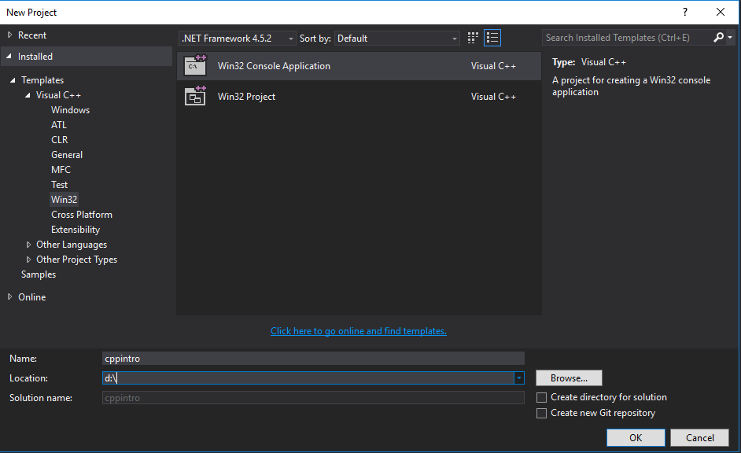
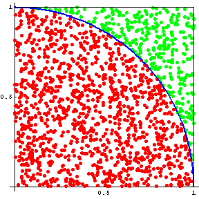

# Week 1 Practical -- Using Visual Studio

## 1. Pair Programming

We will be working in pairs. There's a 50% chance that there is an even number of us, but if not I will come up with some sort of musical chairs arrangement where some pairs are temporarily three. _Pair programming_ is about two people working on one computer, writing code. It's part of the widely used __XP__ (Extreme Programming) methodology and it is generally believed that one programming pair can be just as productive, while generating less bugs, than two individuals.

Here's how it will work for us:

* Log in to two adjacent computers, but only write code on one (the other can be used for this webpage, looking up reference material etc).
* Both programmers are solving the problems (and _talking_ about them) but only one at a time has control of the mouse and keyboard.
* At regular intervals, swap positions.

Pair programming works in the software industry, but it is also great for learning. Thinking aloud helps with developing understanding, and working with peers while actively coding can be very a powerful learning tool. I hope you find it so.

## 2. Creating a Visual Studio Project

Once you are set up with your pair programming team, open Visual Studio on one machine. It might take a while. You may be asked to sign in -- choose 'not now'. You will be asked to choose a colour theme and development settings. Choose ___Visual C++__ for the development settings, the colour theme is up to you. I find dark themes easier on the eye, but it's a matter of taste.

Once Visual Studio is open, follow these steps:

* From the __File__ menu, select __File \> New \> Project__
* In the dialog that appears, make sure the __Visual C++ > Win32__ template is selected in the left pane, __Win32 Console Application__ in the middle, and that you enter a name and a location at the bottom. Choose the __D__ drive for the location, and give the project a name (e.g. __cppintro__). See picture:


* Hit OK, and hit OK again on the next dialog to accept the default settings.
* When the project opens, you should see a sidebar (on the left or right, depending on where Visual Studio decides to put it) called the __Solution Explorer__ (which contains details of the files in the project) and there should be an editor window open with the main program file.
* Notice that there are a few extra files __stdafx.cpp__, __stdafx.h__, __targetver.h__. These are to do with building for windows, and the precompiled header system used to speed the compile times. We could have all turned this off in the settings, but it's easier to run with it.

### 3. Exercise 1: Build and run 'Hello World'

This is the first thing you should do in any programming language.

__Modify the main program so it prints *hello, world*__.

Run it using __Start without debugging__ in the __Debug__ menu, or the keyboard shortcut __Shift+F5__. If the program hasn't been compiled, you will be prompted to do so, or you can build and run separately (__F7__ for build). You can find out if there are any syntax errors by building although Visual Studio flags up errors before this using its _Intellisense_ system which constantly checks the code as you type.

Things to remember:
* You'll need to include the __\<iostream\>__ header (see notes). You can add this either in the main program,
or in __stdafx.h__
* You can add __using namespace std;__ at the top so you don't need __std::__ before __cout__, __endl__ etc.

### 4. Exercise 2: Now get some input

Now to make another program. We want to do this while keeping the first on disk. Achieve this as follows

* In the solution exploroer, right-click on the main __cpp__ file (in my example, this is called cppintro.cpp).
* In the context menu which appears, select 'Remove'.
* Click the 'Remove' button in the next dialog.

This removes the file from the project, but leaves it on disk so you can add it back later on.

* Right-click on the __source__ folder in the solution explorer, and select __Add > New Item__
* The dislog that follows allows you to choose the file type - this should be 'C++ File' by default. Set the file name to (e.g.) "ex2.cpp".
* You should now have a blank C++ file ready for editing. You will need to add the 'boilerplate' (#include "stdafx.h", the main function etc.).

__Write a program so that asks for an integer number, and prints out a times table for that number.__

* Use a variable of type __int__ for the number
* Use __cin__ to get the input (see notes)
* Use a __for__ loop to print out the table

### 5. Exercise 3: Random Numbers

__Write a random number function that returns a random **double** between 0.0 and 1.0__

We will use the C++ standard random generator __mt19937__ for this. This is a very high quality generator (based on the _Mersenne Twister_ algorithm).
The name derives from the period - the random sequence repeats every 2^19937 - 1 numbers. Some of the syntax in using mt19937 won't make sense until
we cover classes next week, but everything you need is in the example below:

```c++
#include "stdafx.h"
#include <iostream>
#include <random>
using namespace std;

mt19937 randGen;

int main()
{
   unsigned int seed = 12345; // usinga different seed will give a different sequence
   randGen = mt19937(seed);
   
   cout << "a random number: " << randGen() << endl;
   cout << "another random number: " << randGen() << endl;
   cout << "the largest possible random number: " << randGen.max() << endl;
   cout << "the smallest possible random number: " << randGen.min() << endl;

   return 0;
}
```
* Start with a new file, as in the previous example
* Cut and paste the example code, run it and see what happens.
* Now create two functions for initializing the generator and generating random numbers, and write a program that tests it by generating some random numbers
* Use a global mt19937 variable as in the example above.
* The functions should look like:

```c++
void InitRandom()
{
   // do stuff...
}
double Random()
{
	//make a random double between 0.0 and 1.0 and return it.
}
```
Make sure you are careful to cast integers to doubles.

### 6. Exercise 4: The Pi Calulation

We will now calculate pi using the _Monte Carlo_ method. The technique works as follows. Imagine you were throwing darts at a circular dartboard, with a square surround which just enclosed the circle, and that you are not very good at darts. The darts will land randomly. The probability of a dart that lands inside the square hitting a point inside the circle is equal to the ratio of the areas of the circle and the square. This ratio is pi / 4. So, if we count the number of darts that land in the circle, and divide by the number of darts that hit the square, we have an estimate of the probability, and hence of pi.

It's more convenient to use a semicircle: see diagram below (from mathfaculty.fullerton.edu)



Here's the algorithm:

1. Set a variable equal to the number of trials (say, __nTrials__) -- try a million to start with.
2. Declare a variable for the number of hits, and set to zero (say, __nHits__)
3. Repeat __nTrials__ times:
   4. Pick two random numbers __x__ and __y__ between 0 and 1
   5. If __x\*x + y\*y <= 1.0__, the point is hit so increment the hit count
6. Calculate pi, from __4 \* hitCount / nTrials__ (be careful to use casts from ints to doubles here).

### 7. Exercise 5: The Distributed Version

Here we will try to turn the class into a disributed parallel processor. Everyone will run their code for
a few minutes, and we will gather the results together into one answer and see how many decimal places
of accuracy we can get. First of all, we need to make the code as fast as possible. This means running the
__release__ build, which is optimized for speed, unlike the __debug__ build we have been making so far (this is
the default).

* From the main menu, choose __Build > Configuration Manager__.
* Open the 'Active Solution Configuration' dropdown and choose release.
* Work out, by running your code and timing (just use a wacch or the PC clock) how many trials you could do in 2 minutes.
* Change your integers (the hit count, number of trials and loop variable in your for loop) to __long long int__ (we will be counting
up to some pretty big numnbers.
* Make sure the code outputs the counts, I will gather the results and calulcate the final value.

That's it for today -- next week, some games programming with SFML.


