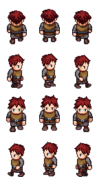
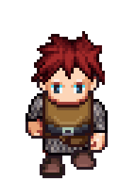

# Week 2 Practical 

## Using the SFML Library

SFML (Simple, Fast Multimedia Library, [sfml-dev.org](https://www.sfml-dev.org)) is an open source C++ library for 2D graphics and audio. We will use it to start making a game, or part of a game at least. Today's aims are 

* Get an SFML project going in Visual Studio (hopefully easy, I've made a skeleton project).
* Create a class for a game avatar -- a character for a 2D top-down RPG, using open art assets from opengameart.org.
* Get the avatar to respond to the WASD keys and walk in the four directions, playing the appropriate walk animations from the sprite sheet.

We'll be using this character sprite sheet from opengameart, by Guarav Munjal ([link](https://opengameart.org/content/universal-lpc-sprite-male-01)). The sprite sheet, with one of the animations, is shown below.

  


### Task 1. Setting up Visual Studio

* The startup prject, including the SFML library and the texture for the character, is on GitHub. Using git is beyond the scope of this course (but is covered in another of the courses) so we will just download the whole thing.
* Look at the top of this page for the blue "View on GitHub" button. 
* Duplicate this tab in your browser so you can see the instructions and the GitHub page at the same time.
* Click the button to go to the GitHub project.
* Click on "Clone or Download", and choose "Download Zip Archive".
* When your zip archive is ready, look inside it, find the "week2start" folder, and copy it onto the __D:__ drive.
* Find the solution file (week2start.sln), double click it to open in visual studio, build anr run.

If that all worked, you should have a blank window (title "MyGame"). Hit escape to dismiss it.

### The Game class

The __Game__ class provided in the project deals with the basic interactions with SFML. You will notice it has three empty functions called __Init__, __Update__ and __Draw__. These are self-explanatory, and are where we will hook into to get all the game behaviour we want. The __Game__ class creates an object of class __sf::RenderWindow__. All SFML classes live in the __sf::__ namespace. __RenderWindow__ is a window that we can draw on. Other classes will need a __pointer__ to this window to be able to send it drawing commands; the __Game__ class provides this through the __GetSFMLWindow__ function.

* Have a quick scan of the __Game__ class. It's hopefully fairly self-explanatory.

### Task 2. Create an Avatar class

We will make a class called __Avatar__ to represent our little RPG chap. Follow these instructions.

* Add a header file called __Avatar.h__ and a C++ file called __Avatar.cpp__. Do this by right-clicking on the "Header Files" and "C++ Files" folders in the solution explorer, and choosing "Add new item". The dialog that follows should be familiar from last week.

* Define the skeleton of the __Avatar__ class. We want it to have a pointer to the game, so we can get a pointer to the render window. Here's the header file code -- add this after the "#pragma once".

```c++
#include "stdafx.h"
class Game;

class Avatar
{
   Game* parent;

public:
   Avatar(Game *newParent);
   void Update();
   void Draw();
};
```

* Here's the C++ code (for the C++ file)

```c++
#include "Avatar.h"
#include "Game.h"

Avatar::Avatar(Game *newParent) : parent(newParent)
{
}

void Avatar::Update()
{
}

void Avatar::Draw()
{
}
```

* Build and run the code -- proceed to the next stage when any build errors have been ironed out.

### Task 3 -- Adding an image

We will now add some functionality to enable the Avatar to enable us to display an image. First of all we need a position for the avatar. Add two __int__ variables to the class, __posX__ and __posY__ to store the x and y coordinates of the player. Initialize these in the constructor so that the player starts in the middle of the screen. Here's the code to add to the class definition and constructor (I'll assume you have added the variables to the class definition in the header file):

```c++
   // inside class definition, in Avatar.h
   int posX;
   int posY;

   // in the Avatar constructor (c++ file)
   posX = parent->GetSFMLWindow()->getSize().x / 2;
   posY = parent->GetSFMLWindow()->getSize().y / 2;
```
This code gets a pointer to the window, from the game (parent), then uses that pointer to call __getSize()__. This returns an SFML vector object with x and y components representing width and height of the window.

Next we need to load the sprite sheet image into a texture ('texture' is a graphics term for an image that is used to render an object). Add a variable to the __Avatar__ class of type __sf::Texture__, called __spriteSheet__, and then in the constructor, load the image using this code

```c++
// in the header file:
   sf::Texture spriteSheet;

// in the constructor
   spriteSheet.loadFromFile("Assets/universal-lpc-sprite_male_01_walk-3frame.png");
```

We need one more step before we can draw the image. SFML draws 2D images using __sprites__. In SFML, a sprite needs two pieces of information about the image - the texture (we have already dealt with that) and a texture rectangle (the rectangular area of the texture that we want to draw). The texture rectangle is described using an __sf::IntRect__ object. The sprite sheet texture has 12 images on it, so we will create twelve __sf::IntRect__ objects, and store them in an array. Add the following code:

```c++
// in the header file (inside the class definition):
   sf::IntRect textureRects[12];

// in the constructor
   int textureWidth = spriteSheet.getSize().x;
   int textureHeight = spriteSheet.getSize().y;
   int spriteWidth = textureWidth / 3; // three sprites in one row
   int spriteHeight = textureHeight / 4; // four rows
   
   for (int i = 0; i < 3; i++)
   {
      for (int j = 0; j < 4; j++)
      {
         textureRects[j * 3 + i] =
             sf::IntRect(spriteWidth*i, spriteHeight*j, spriteWidth, spriteHeight);
      }
   }
```

You should be able to work out from here which rectangle is which. They are stored in order, row by row, from the top down.

Now to draw a sprite at the position of the avatar. We need to add an avatar object to the game class

```c++
// at the top of the game.h file:
#include "Avatar.h"

// inside the class definition (game.h), add a pointer variable
   Avatar *avatar;

// in the c++ file, in the Init() function
   avatar = new Avatar( this );

// in the c++ file, in the Draw() function
   avatar->Draw();
```
Notice the use of __this__ in the Avatar constructor call. This is a pointer to the current object. The constructor wants a pointer to a Game object, so we give it __this__ -- "this" instance of Game.

Now fill in the __Draw__ function in Avatar, and we are done.

```c++
void Avatar::Draw()
{
   sf::Sprite sprite;
   sprite.setTexture(spriteSheet);
   sprite.setTextureRect(textureRects[4]);
   sprite.setPosition(sf::Vector2f(posX, posY));
   parent->GetSFMLWindow()->draw(sprite);
}
```
Here we construct an SFML Sprite object, fill in the details (texture, textureRect, position) and send it to the window for drawing.

Run the game -- you should see the little guy in the middle of the screen.

### Task 4 -- Movement.
We will now add some code to the Avatar __Update__ function, to interrogate the keyboard, and move the Avatar. 
We can check which keys are down using the functions in __sf::Keyboard__. You need to do two things -- first add
a call to the Avatar update function in the __Game__ class:

```c++
void Game::Update()
{
   // once-per-frame update
   avatar->Update();
}
```

Then modify the __Update__ function in the Avatar class: I will leave you to finish this off:

```c++
// in the Avatar::Update() function
   if (sf::Keyboard::isKeyPressed(sf::Keyboard::A))
   {
      posX -= 3;
   }
```

Notice that the y direction is reversed (negative y is up) as in most graphics applications. At the end of this step, you should be able to 
control your character.

### Task 5 -- Facing the right way

Now to choose different sprites depending on the last direction of movement. We will first define some constants, and a variable to keep track of the current direction.

```c++
// in the Avatar class definition:
   const int DIRECTION_LEFT = 0;
   const int DIRECTION_RIGHT = 1;
   const int DIRECTION_UP = 2;
   const int DIRECTION_DOWN = 3;

   int direction = DIRECTION_LEFT;
```
Notice we initialized a variable in the class definition, rather than a constructor. This is allowed in C++11 -- older compilers may complain about this.

Now in the Update function, change the direction whenever input is received, for example:

```c++
   if (sf::Keyboard::isKeyPressed(sf::Keyboard::A))
   {
      posX -= 3;
      direction = DIRECTION_RIGHT;
   }
```

I'll leave you to fill in the other directions. Now in the Draw function, we need to choose a different sprite based on the direction. 

* Add the following code at the beginning of Avatar::Draw:

```c++
   int spriteIndex = 0;
   if (direction == DIRECTION_LEFT)
      spriteIndex = 4;
   else if (direction == DIRECTION_RIGHT)
      spriteIndex = 10;
   else if (direction == DIRECTION_UP)
      spriteIndex = 1;
   else if (direction == DIRECTION_DOWN)
      spriteIndex = 7;
```

* replace the __[4]__ in the setTextureRect call with __[spriteIndex]__.

The player should now face the way he is moving.

### Task 6 -- Animation

The final task is the animation. We need several things here. 

* First, some idea of time. To the Avatar class add an integer variable called __tick__,
initialized to zero. Add one to it in the __Avatar::Update__ function so it 'ticks' time.

* Second, we need to know if the character is walking or not. Do this with a __bool__ variable, as follows:

```c++
// in the class definition (Avatar.h)
   bool walking = false;

// in the Avatar::Update function
   walking = false;
   if (sf::Keyboard::isKeyPressed(sf::Keyboard::A))
   {
      posX -= 3;
      direction = DIRECTION_RIGHT;
      walking = true;
   }
   // repeat for the other directions
```

* Third, we need to choose the frame based on time, direction and whether the player is walking or not. 

We will use a simple scheme for this. Notice that the idle frame is in the middle of each row. The walk
animation involves playing the frames to the left and right of this -- these are offset by -1 and +1 in the
textureRects array. So the walk animation boils down to adding offsets of -1, 0, 1, 0, -1, 0, 1, 0 and so on
to the idle frame. Here's some simple code for doing this: add it to the Draw function, between calculating
__spriteIndex__ and drawing the sprite.

```c++
	int spriteOffset = 0;
	int animSpeed = 3;
	int animFrame = (tick / animSpeed) % 4;
	if (walking)
	{
		if (animFrame == 1)
			spriteOffset = -1;
		else if (animFrame == 3)
			spriteOffset = 1;
	}
	spriteIndex = spriteIndex + spriteOffset;
```

Notice the use of the % operator -- this is the modulus, or remainder on division, operator. 
The __animSpeed__ variable controls the speed (higher values are slower). Tweak this until the
animation looks right.

That's it!

### Polish

You may want to add some polish. Three things you could do:

* Make it so the player responds to the arrow keys as well as WASD. You can use the intellisense prompts to help find the SFML constants for these keys.
* Find a background image, and draw it under the player (do this in the Game class, or make a new class called Background).
* Stop the player from walking off the screen.

Next week we will add some interactions with objects in the world. 


