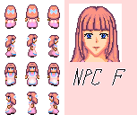
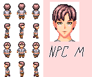
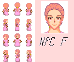
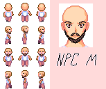

# Week 3 Practical: Adding Interaction

Last week we made a walking character. This week we will give him some people to interact with.

## Task 1: Setting up.

If you finished last week's tutorial, you will have the code ready do go. If not, you can download
the GitHub repository and copy the __week2done__ folder. From now I'll assume you are up to speed at
the end of week 2.

* From the GitHub repository, download the new art assets for this week. You can find these in the
__week3assets__ folder. If you open the folder and click on the assets in turn, you can download them
individually. Put all the files into the __Assets__ folder in the Visual Studio project directory.

### Assets

This week's asset are from two sources. Firstly, there is a font called __Cave-Story__. This is a retro
game style font downloaded from [fontlibrary](https://fontlibrary.org/en/font/cave-story).
Secondly, there are some RPG character teaxtures from [opengameart](https://opengameart.org/content/24x32-characters-with-faces-big-pack). 
These were produced by Svetlana Kushnariova (lana-chan@yandex.ru). I took a few of the characters from this pack, and replaced the key-colour with transparency.
There are many more characters in this pack -- enough to make quite a large game.



These spritesheets have more images than we will use (they have walk animations and portraits). They are also 24x32 so we
will need to scale up to match our avatar. We will use them to make some characters who populate the world.
When the player approaches the characters, a message will appear next to the player on the screen.

## Task 2: Loading Assets

There will be a fair amount of setting up code before we get to see anything new this week. First we
will load the font and textures. We will do this in the __Game__ class . It might make sense at this
point to take all this into a new class (say, AssetManager) and you may want to do that if you develop this further, 
but for now we'll keep it in the Game class (by the way 'for now' is a very common
comment in game code...). We will add an __sf::Font__ member, and a __map__ for the textures, 
which we will index with strings.

```c++
// add to sfdafx.h (we will need both these today)
#include <map>
#include <vector>

// before the class definition, in Game.h
   using namespace std;

// add this to the Game class definition, in Game.h
   sf::Font font;
   map<string, sf::Texture> textureList;
```


```c++
// in the Game::Init function

   font.loadFromFile("Assets/Cave-Story.ttf");

// load some textures and put them in the texture map
   sf::Texture loadTex;
   loadTex.loadFromFile("Assets/Townfolk-Adult-F-002.png");
   textureList["female1"] = loadTex;
   loadTex.loadFromFile("Assets/Townfolk-Adult-F-005.png");
   textureList["female2"] = loadTex;
   loadTex.loadFromFile("Assets/Townfolk-Adult-M-003.png");
   textureList["male1"] = loadTex;
   loadTex.loadFromFile("Assets/Townfolk-Adult-M-006.png");
   textureList["male2"] = loadTex;
```

So, we are loading textures one by one and putting them in the map. Notice we reuse the
same texture -- this is OK because adding to the map creates a copy in the map.

Check everything builds and still runs -- iron out any erros before proceeding.

## Task 3: A Character Class

* Add two new files to the project: __character.h__ and __character.cpp__.
* Fill in the skeleton of the class, as below

```c++
// header file
#include "stdafx.h"
class Game;
using namespace std;

class Character
{
   sf::Texture& texture;
   sf::IntRect textureRect;
   int posX;
   int posY;
   Game *parent;
   string message;

public:
   Character( Game *parent, sf::Texture& tex, sf::IntRect rect, 
              int px, int py, string message );
   void Update();
   void Draw();
};
```

```c++
// cpp file
#include "stdafx.h"
#include "Character.h"
#include "Game.h"

Character::Character(Game *parent, sf::Texture& tex, sf::IntRect rect, 
                     int px, int py, string message)
	: parent(parent), texture(tex), textureRect(rect), 
          posX(px), posY(py), message(message)
{
}

void Character::Update()
{
}

void Character::Draw()
{
}
```

So, we have __Update__ and __Draw__ as usual, a pointer to the game, a position, a string for the message to be
displayed, and the assets needed to draw a sprite (a __Texture__ and an __IntRect__). Note we are using a reference
to the texture.

* Check eveything still compiles, then we can add a character in the game

## Task 4: Add a character

Back in the __Game__ class, we will now add a __vector__ to store a list of characters. Add the following code to set this up

```c++
// at the top of Game.h
#include "Character.h"

// in the class definition in Game.h
    vector<Character*> characterList;
```

```c++
// in Game.cpp, in the Init function (after the asset loading)
   Character* character;
   character = new Character(this, textureList["female1"], 
                 sf::IntRect(24, 64, 24, 32), 250, 200, 
                 string("Hello, my name is Alice\nHow do you do?"));
   characterList.push_back(character);

// in the Update funxtion
   for ( Character *c : characterList )
      c->Update();

// In the Display function
   for ( Character *c : characterList )
      c->Draw();

```

This is self-explanatory -- we made a character using one frame of one of the textures, and using __push\_back__, we added it to the list. We use the range-based for loop to loop over the array to update and draw. Note the __\\n__ in the string - this is a newline symbol to split the message over two lines.

* Check the code still compiles and runs

### Task 5: Exercise - Draw the Character

Using what you learned last week, fill in the __Draw__ function in the __Character class so we can see a character. Note the texture is half the size -- you can use the __setScale__ method in the __sf::Sprite__ class to fix this:

```c++
sprite.setScale(sf::Vector2f(2.0f, 2.0f));
```

Continue when you can see the character on screen.

### Task 6: Adding the message

The first stage is to make the character aware of the player. I will leave you to accomplish the following two steps:

* Add, and implement a function in the __Game__ class called __Avatar *GetAvatar()__ which returns a pointer to the avatar
* Add two functions to the __Avatar__ class that return the x and y position: __int GetXPos()__ and __int GetYPos()__.

Now add the following to the __Character__ class.

```c++
// in the class definition
   bool showMessage;

// in the Update function
   int px = parent->GetAvatar()->GetPosX();
   int py = parent->GetAvatar()->GetPosY();

   showMessage = ((px - posX)*(px - posX) + (py - posY)*(py - posY) < 80*80);
```

This is testing the position of the character against the avatar (using pythagoras to get the squared distance) and if it is less than
some radius, sets a bool variable to indicate we should display the message.

Finally to display the message.

* Add a function to the Game class to return a reference to the font.

```c++
// in Game.h, in the class definition
   const sf::Font& GetFont() { return font; }
```

Notice this is returning a __const__ reference. Why? We dont want this function to be used to change anything. If this was
a non-const reference, another class could use this to modify the font, which we don't want to happen (other classes may be
relying on it staying the same).

Finally, in the Character class, add:

```c++
// in the Update function, in character.cpp
   if (showMessage)  
   {
      // draw some text
      sf::Text text;
      text.setFont(parent->GetFont());
      text.setPosition(sf::Vector2f(posX, posY));
      text.setString(sf::String(message));
      text.setCharacterSize(24);
      parent->GetSFMLWindow()->draw(text);
   }
```

That's it! Test the functionality, and if it works, add some other characters with different textures and different messages.

